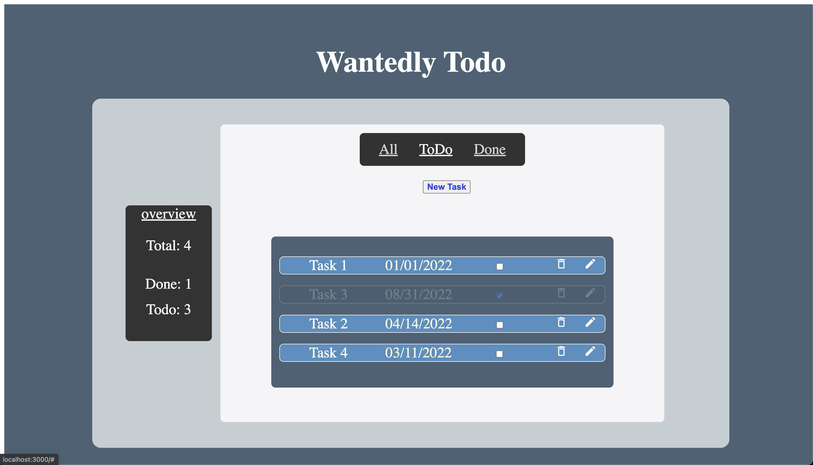

### `npm start`
After cloning the repo, \
Runs the app in the development mode.\
Open [http://localhost:3000](http://localhost:3000) to view it in your browser.

The page will reload when you make changes.\
You may also see any lint errors in the console.

## note
タスクの状態に基づき表示タスクの変更\
useMemo, useCallbackの利用で今後Componentが増えた際の無駄なページのリフレッシュを減らす

  

Improvements. \
-handle multipule users by storig data to json file or a server.\
-have a backend to handle data (e.g. firebase) \
-implement drag and drop functionality\
-sort items based on the due date\
-write in TypeScript instead of JavaScript\
-(to implement Dnd, https://www.wantedly.com/companies/wantedly/post_articles/386188 maybe helpful) \
-react-beautiful-dnd does not support multiple rows. use react-dnd instead.